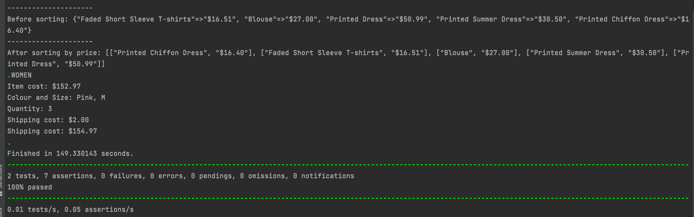

Description
#Coverage

##Prerequisites
`Firefox v.94.0.2`

`selenium-webdriver v.3.14.1`

`test-unit v.3.2.7`

##How to run CodingQ1WebTest:
To run the script, run the following command

`ruby coding_q1_web_test.rb`

##Expected Results
Check results on the console for results similar to the below screenshot.

##How to run DataDrivenTest:
To run the script, run the following command

`ruby coding_q2_data_driven.rb`